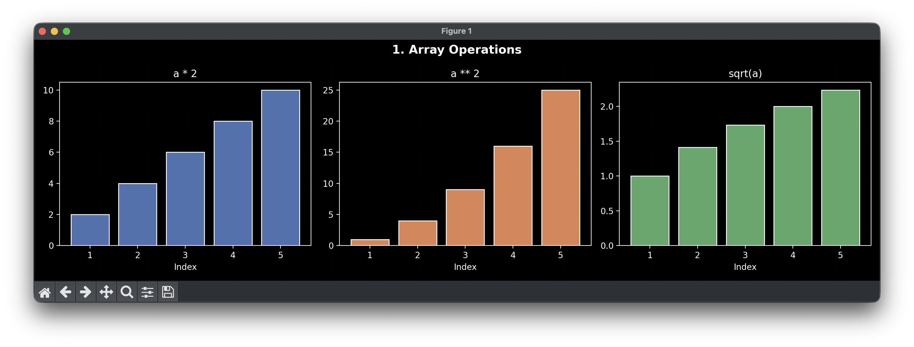
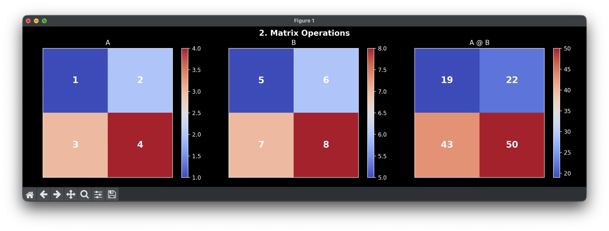
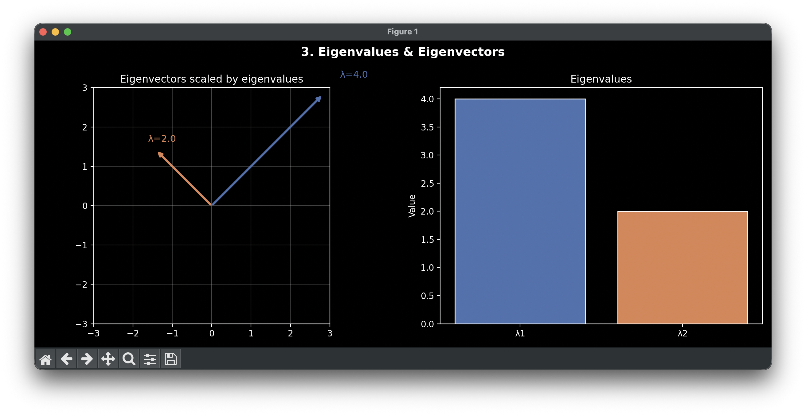
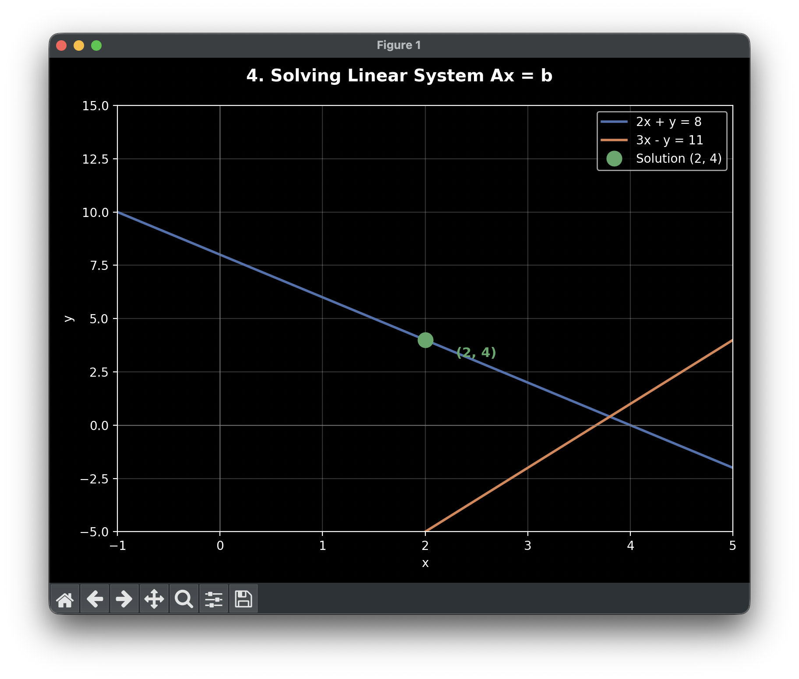
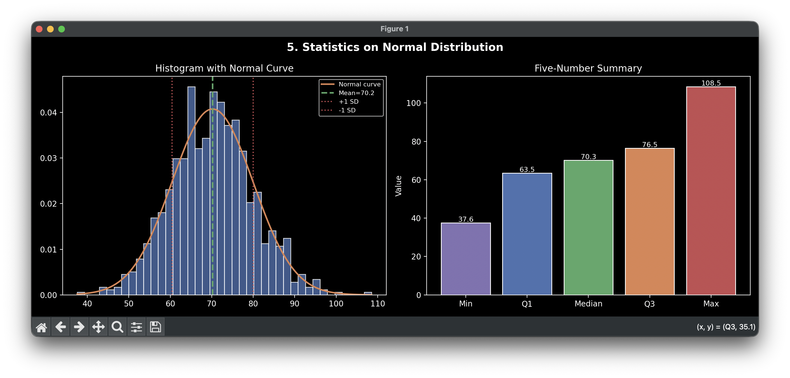
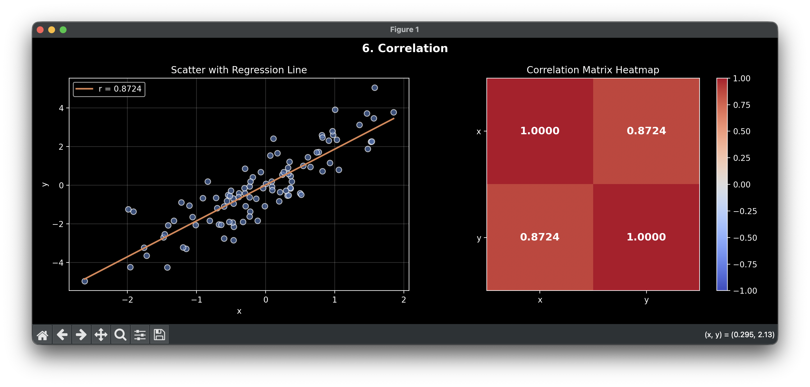
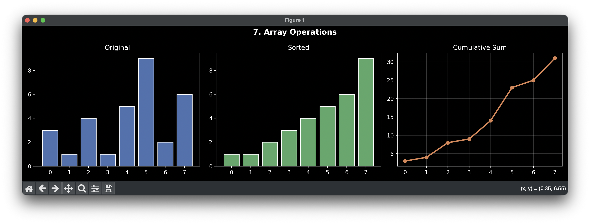
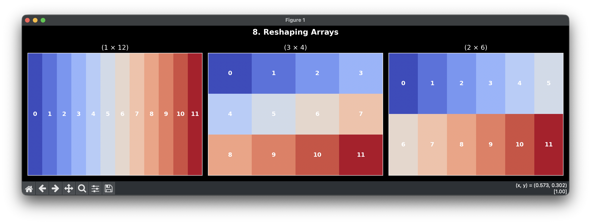

```python
import numpy as np
import matplotlib.pyplot as plt

plt.style.use("dark_background")
BLUE   = "#4C72B0"
ORANGE = "#DD8452"
GREEN  = "#55A868"
RED    = "#C44E52"
PURPLE = "#8172B2"

# -----------------------------------------------
# 1. Array Operations
# -----------------------------------------------
fig, axes = plt.subplots(1, 3, figsize=(14, 4))
fig.suptitle("1. Array Operations", fontsize=14, fontweight="bold")

a = np.arange(1, 6)
axes[0].bar(a, a * 2, color=BLUE, edgecolor="white")
axes[0].set_title("a * 2")
axes[0].set_xlabel("Index")

axes[1].bar(a, a ** 2, color=ORANGE, edgecolor="white")
axes[1].set_title("a ** 2")
axes[1].set_xlabel("Index")

axes[2].bar(a, np.sqrt(a), color=GREEN, edgecolor="white")
axes[2].set_title("sqrt(a)")
axes[2].set_xlabel("Index")

plt.tight_layout()
plt.show()

# -----------------------------------------------
# 2. Matrix Heatmaps
# -----------------------------------------------
fig, axes = plt.subplots(1, 3, figsize=(14, 4))
fig.suptitle("2. Matrix Operations", fontsize=14, fontweight="bold")

A = np.array([[1, 2], [3, 4]])
B = np.array([[5, 6], [7, 8]])
C = A @ B

for ax, mat, title in zip(axes, [A, B, C], ["A", "B", "A @ B"]):
    im = ax.imshow(mat, cmap="coolwarm")
    ax.set_title(title)
    plt.colorbar(im, ax=ax)
    for i in range(mat.shape[0]):
        for j in range(mat.shape[1]):
            ax.text(j, i, mat[i, j], ha="center", va="center",
                    fontsize=16, fontweight="bold")
    ax.set_xticks([])
    ax.set_yticks([])

plt.tight_layout()
plt.show()

# -----------------------------------------------
# 3. Eigenvalues
# -----------------------------------------------
fig, axes = plt.subplots(1, 2, figsize=(12, 5))
fig.suptitle("3. Eigenvalues & Eigenvectors", fontsize=14, fontweight="bold")

A = np.array([[3, 1], [1, 3]])
values, vectors = np.linalg.eig(A)

ax = axes[0]
ax.set_xlim(-3, 3)
ax.set_ylim(-3, 3)
ax.axhline(0, color="gray", lw=0.5)
ax.axvline(0, color="gray", lw=0.5)
colors = [BLUE, ORANGE]
for i, (val, vec) in enumerate(zip(values, vectors.T)):
    ax.annotate("", xy=vec * val, xytext=(0, 0),
                arrowprops=dict(arrowstyle="->", color=colors[i], lw=2.5))
    ax.text(*(vec * val * 1.15), f"λ={val:.1f}", color=colors[i], fontsize=11)
ax.set_title("Eigenvectors scaled by eigenvalues")
ax.set_aspect("equal")
ax.grid(True, alpha=0.2)

axes[1].bar([f"λ{i+1}" for i in range(len(values))], values,
            color=[BLUE, ORANGE], edgecolor="white")
axes[1].set_title("Eigenvalues")
axes[1].set_ylabel("Value")

plt.tight_layout()
plt.show()

# -----------------------------------------------
# 4. Solving a Linear System
# -----------------------------------------------
fig, ax = plt.subplots(figsize=(8, 6))
fig.suptitle("4. Solving Linear System Ax = b", fontsize=14, fontweight="bold")

x_vals = np.linspace(-2, 6, 300)
line1 = 8 - 2 * x_vals             # 2x + y = 8
line2 = 3 * x_vals - 11            # -3x - y = -11  →  y = 3x - 11

ax.plot(x_vals, line1, color=BLUE,   lw=2, label="2x + y = 8")
ax.plot(x_vals, line2, color=ORANGE, lw=2, label="3x - y = 11")
ax.plot(2, 4, "o", color=GREEN, markersize=12, zorder=5, label="Solution (2, 4)")
ax.annotate("(2, 4)", xy=(2, 4), xytext=(2.3, 3.2),
            color=GREEN, fontsize=11, fontweight="bold")
ax.set_ylim(-5, 15)
ax.set_xlim(-1, 5)
ax.axhline(0, color="gray", lw=0.5)
ax.axvline(0, color="gray", lw=0.5)
ax.legend()
ax.grid(True, alpha=0.2)
ax.set_xlabel("x")
ax.set_ylabel("y")

plt.tight_layout()
plt.show()

# -----------------------------------------------
# 5. Statistics
# -----------------------------------------------
fig, axes = plt.subplots(1, 2, figsize=(13, 5))
fig.suptitle("5. Statistics on Normal Distribution", fontsize=14, fontweight="bold")

np.random.seed(42)
data = np.random.normal(loc=70, scale=10, size=1000)
mean = np.mean(data)
std  = np.std(data)

axes[0].hist(data, bins=40, color=BLUE, edgecolor="white", alpha=0.8, density=True)
x = np.linspace(data.min(), data.max(), 300)
axes[0].plot(x, (1 / (std * np.sqrt(2 * np.pi))) * np.exp(-0.5 * ((x - mean) / std) ** 2),
             color=ORANGE, lw=2, label="Normal curve")
axes[0].axvline(mean, color=GREEN, lw=2, linestyle="--", label=f"Mean={mean:.1f}")
axes[0].axvline(mean + std, color=RED, lw=1.5, linestyle=":", label=f"+1 SD")
axes[0].axvline(mean - std, color=RED, lw=1.5, linestyle=":", label=f"-1 SD")
axes[0].legend(fontsize=8)
axes[0].set_title("Histogram with Normal Curve")

labels = ["Min", "Q1", "Median", "Q3", "Max"]
vals   = [np.min(data), *np.percentile(data, [25, 50, 75]), np.max(data)]
axes[1].bar(labels, vals, color=[PURPLE, BLUE, GREEN, ORANGE, RED], edgecolor="white")
for i, v in enumerate(vals):
    axes[1].text(i, v + 0.5, f"{v:.1f}", ha="center", fontsize=9)
axes[1].set_title("Five-Number Summary")
axes[1].set_ylabel("Value")

plt.tight_layout()
plt.show()

# -----------------------------------------------
# 6. Correlation
# -----------------------------------------------
fig, axes = plt.subplots(1, 2, figsize=(13, 5))
fig.suptitle("6. Correlation", fontsize=14, fontweight="bold")

np.random.seed(42)
x = np.random.randn(100)
y = 2 * x + np.random.randn(100)
corr = np.corrcoef(x, y)[0, 1]

axes[0].scatter(x, y, color=BLUE, alpha=0.7, edgecolors="white", s=50)
m, b = np.polyfit(x, y, 1)
axes[0].plot(np.sort(x), m * np.sort(x) + b, color=ORANGE, lw=2, label=f"r = {corr:.4f}")
axes[0].set_title("Scatter with Regression Line")
axes[0].legend()
axes[0].set_xlabel("x")
axes[0].set_ylabel("y")
axes[0].grid(True, alpha=0.2)

corr_matrix = np.corrcoef(x, y)
im = axes[1].imshow(corr_matrix, cmap="coolwarm", vmin=-1, vmax=1)
plt.colorbar(im, ax=axes[1])
axes[1].set_xticks([0, 1])
axes[1].set_yticks([0, 1])
axes[1].set_xticklabels(["x", "y"])
axes[1].set_yticklabels(["x", "y"])
for i in range(2):
    for j in range(2):
        axes[1].text(j, i, f"{corr_matrix[i,j]:.4f}",
                     ha="center", va="center", fontsize=13, fontweight="bold")
axes[1].set_title("Correlation Matrix Heatmap")

plt.tight_layout()
plt.show()

# -----------------------------------------------
# 7. Array Operations
# -----------------------------------------------
fig, axes = plt.subplots(1, 3, figsize=(14, 4))
fig.suptitle("7. Array Operations", fontsize=14, fontweight="bold")

a = np.array([3, 1, 4, 1, 5, 9, 2, 6])
idx = np.arange(len(a))

axes[0].bar(idx, a, color=BLUE, edgecolor="white")
axes[0].set_title("Original")
axes[0].set_xticks(idx)

axes[1].bar(idx, np.sort(a), color=GREEN, edgecolor="white")
axes[1].set_title("Sorted")
axes[1].set_xticks(idx)

axes[2].plot(idx, np.cumsum(a), color=ORANGE, lw=2.5, marker="o", markersize=6)
axes[2].set_title("Cumulative Sum")
axes[2].set_xticks(idx)
axes[2].grid(True, alpha=0.2)

plt.tight_layout()
plt.show()

# -----------------------------------------------
# 8. Reshaping
# -----------------------------------------------
fig, axes = plt.subplots(1, 3, figsize=(14, 4))
fig.suptitle("8. Reshaping Arrays", fontsize=14, fontweight="bold")

a = np.arange(12)
shapes = [(1, 12), (3, 4), (2, 6)]
titles = ["(1 × 12)", "(3 × 4)", "(2 × 6)"]

for ax, shape, title in zip(axes, shapes, titles):
    mat = a.reshape(shape)
    ax.imshow(mat, cmap="coolwarm", aspect="auto")
    for i in range(shape[0]):
        for j in range(shape[1]):
            ax.text(j, i, mat[i, j], ha="center", va="center",
                    fontsize=11, fontweight="bold")
    ax.set_title(title)
    ax.set_xticks([])
    ax.set_yticks([])

plt.tight_layout()
plt.show()
```















